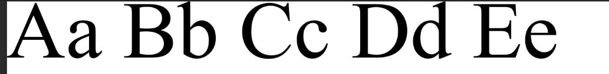
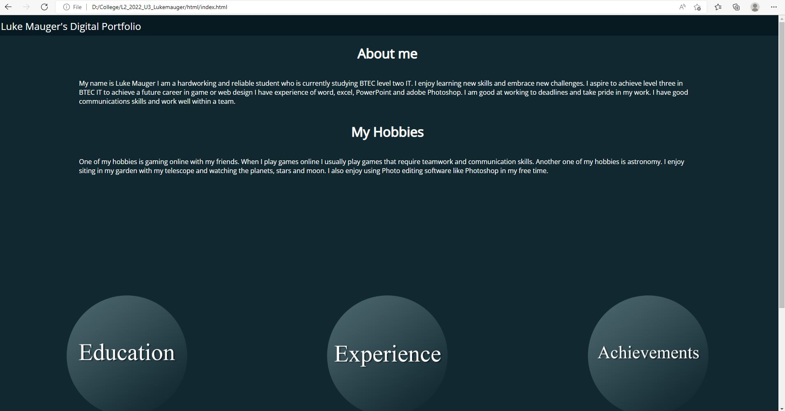
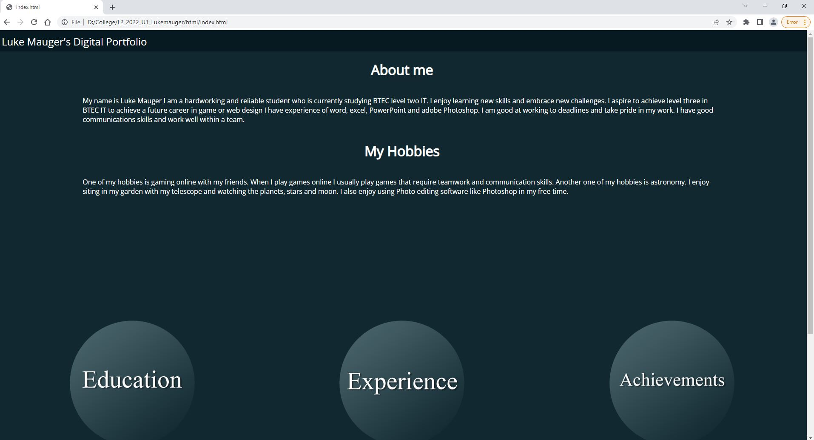
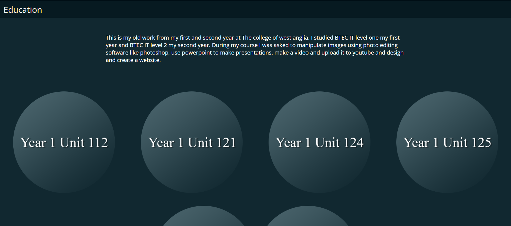
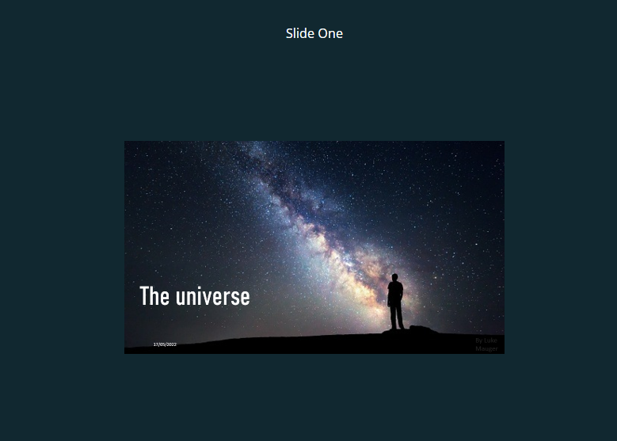
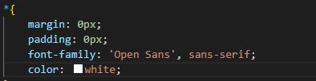

# portfolio
I am creating this portfolio for an IT job with a potential employer I will use it to show them the range of my skill and how much experience I have.
I will do that by showing my work from previous assignments using video's text and images.

## audience needs

## Timeline
I created the timeline in photoshop

## colour scheme
contrast checker https://coolors.co/contrast-checker/071a21-ffffff

https://paletton.com/#uid=13p0u0kgCbEavlyc8fNlo9Bqz6C

I have chosen this colour scheme because it's contrast with my chosen text makes it easier to see for people with poor eyesight.

https://paletton.com/#uid=1000u0kw0brlIlJr3gpHQ70Sq3g

## text
the colour of my text will be white because it has good contrast with the colour scheme I have chosen this is good because it is easier for people with bad eyesight. 

I have chosen Open Sans as my font because  It’s incredibly readable in small sizes and also works great when printed in huge letters.

The second text I will be using for buttons is Times new roman because it is the world’s go-to font for official looking documents, has been found to be the most trusted typeface among the UK public.

## storyboards
This is the story board for my Home page.

This is the storyboard for the education page.

# Alternative solutions
## alternative text
An alternative font i could have used is Roboto slab because It’s geometric form and friendly curves make it works really well for both headers and body texts. 

## Alternative colour scheme
this is the alternative colour scheme I haver chosen.

I have chosen this because it's contrast with my chosen alternative text makes it easier to see for people who are visually impaired.

## alternative storyboard
this is the alternative storyboard created with the alternative solutions.

# Browser Test
I have checked that my portfolio works in two browser.

## Microsoft edge test test

## Chrome test

My digital portfolio works in both browsers and all images, links and videos work and the navigation is smooth and consistent.

# navigation
This navigation table will tell you which pages link to which the &check; means they will the X means they wont.

|   |Home|Education|Achievements|Experience|Unit 112|Unit 121|Unit 124|Unit 125|Unit 3|MOS|
|---|---|---|---|---|---|---|---|---|---|---|
|Home|&check;|&check;|&check;| &check;  | X  | X  | X  | X  |  X |X|
|Education| &check;  | &check;  | X  |  X |  &check; |  &check; |  &check; |  &check; |  &check; |&check;|
|Achievements| &check;  |  X |  &check; | X  | X  |  X |  X |  X |  X |X|
|Experience| &check;  |  X | X  |  &check; |  X | X | X  |  X |  X |X|
|Unit 112|  X | &check;  | X  |  X | &check; | X  |  X | X  | X  |X|
|Unit 112|  X | &check;   |  X |  X | X  |   X|  X |  X | X  |X|
|Unit 121|  X |&check;    | X  |  X | X  |  &check; |  X |  X |  X |X|
|Unit 124|  X | &check;   |  X |  X |  X |  X |  &check; |  X |  X |X|
|Unit 125|  X | &check;   |  X |  X | X  |  X | X  |  &check; |  X |X|
|Unit 3| X  | &check;   | X  |  X | X  | X  | X  | X  | &check;  |X|
|MOS| X  |  &check;  | X  |  X | X  | X  | X  | X  | X |&check; |

# Asset list

## work Experience
Cambridgeshire Community Reuse & Recycling Network Logo https://www.ccorrn.org.uk/
Student portal work experience tracker https://cwa.ac.uk/student-login
## My achievements
MOS certificate taken by Luke Mauger 09/06/22 with my mobile phone.
Pearson BTEC certificate taken by Luke Mauger on 09/06/22 with my mobile phone.
## Education
### U13
all screenshots were taken from my website file:///D:/College/L2_2022_U13_LukeM%20OD/doc/src/html/index.html
and all storyboards were made by me using photoshop.
### MOS
Word Logo https://toppng.com/show_download/101079/word-logo/large

Powerpoint Logo https://www.bing.com/images/search?q=PowerPoint%20Logo&FORM=IQFRBA&id=413027F53D10397069E7DB21BB8EBFFDB4DE1250

Excel Logo https://www.bing.com/images/search?view=detailV2&ccid=Y3PQTR5l&id=CD6437CE3A2CC18DC70C83B8D9FF5E9AE89F9895&thid=OIP.Y3PQTR5lZlJWQ8-IETFwoQHaHa&mediaurl=https%3a%2f%2fsolutionscenter.nethope.org%2fimages%2fsite_images%2fMicrosoft_Excel-logo.png&cdnurl=https%3a%2f%2fth.bing.com%2fth%2fid%2fR.6373d04d1e6566525643cf88113170a1%3frik%3dlZif6Jpe%252f9m4gw%26pid%3dImgRaw%26r%3d0&exph=1200&expw=1200&q=excel+logo&simid=608047217768949222&FORM=IRPRST&ck=997B2B3166B7B417A4AE2409A5DD40EE&selectedIndex=7

### U125
Powerpoint image link

https://www.popularmechanics.com/space/deep-space/a31223484/milky-way-warped/

### U121
Unedited Church picture- Taken by Luke Mauger on Mobile phone. 26/01/21
Unedited car picture- Taken by Luke Mauger on mobile Phone 26/01/21
Unedited phone Picture- Taken by Luke Mauger on mobile phone 26/01/21

#### Red car image
Magazine name: The ultimate history of the Porsche   

ISBN 1-4-0-5-4-5-6-9-1-4 

Page number 118

#### Robot Image
Magazine name: Google robots don’t be afraid 

Issue- 235 

Date May 2014 

Page number 27 

#### tower image
Magazine name: Contemporary Japanese Architecture  

ISBN 3-8-2-2-8-9-4-4-2-7 

Page number 93 

### U124
Video I made and posted to YouTube https://youtu.be/aAgK1X0WnSA
### U112
Both Logos were made by Luke Mauger in photoshop in 2021.

# Justification
# feedback
## student feedback

### Mitchell
Firstly, I approve of the chosen colour scheme, very simple and professional, the layout and the navigation is not complex and easy to navigate through, the animation for the intractable features is a good way of showcasing your coding skills. To improve this, I would add some explanation some more information for what the images are, pretty much add more context so that employers fully understand what they are looking at. Also, I would the add some explanation for what the images of your projects prove so that employers are aware of what skills these are displaying.

### Daine
 website portfolio looks great nice colour scheme, very eay to navigate and find what you want to know, good design however on unit 125 with powerpoint things there is just to much information and a lot to read.
### Patryk
Portfolio looks fine, the colour scheme are too dark but fits with the colour text, navigation is easy to use and find what you need. I would prefer to add more text in 'Education' and explain more in details of what you've done there.

### Aiden
The font is really nice and the size is great to read from. There are more than 2 font types, and I think it would benefit from using only two fonts to keep simplistic look. The layout is very simple and easy to select where I want to go and easy to go back and fourth. It lacks eye candy which makes it not as interactive and colourful. It does look a bit bland with the colour scheme as well. The website also lacks scaling, which doesn't look well on mobile phones or smaller screens to 1920x1080 monitors. 
### 
# feedback review
According to feedback Education need more text explaining its content. To do this I have added text to the Education page explaining what I did in college and what I did for my assignments.

I also changed The Unit 125 page so now their isn't as much information instead there is a link to the presentation.

In regards to Aidens review I have made sure the only fonts used are Open sans for the website.

And Times new roman for the buttons which were made in Photoshop.

# Portfolio review
The Finale design is suitable for the intended audience and purpose because it displays my skills, experience and education to potential employers it shows them what I have done and what I can do. one way my portfolio fulfills the intended purposes is with the "animation for the intractable features is a good way of showcasing your coding skills" and because Daine said "very easy to navigate and find what you want to know".
