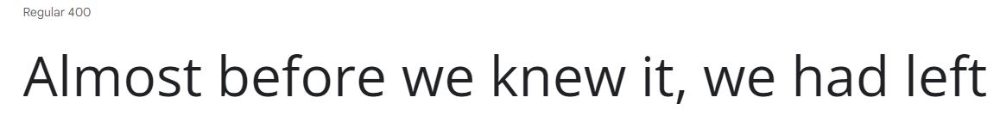

## portfolio
I am creating this portfolio for an IT job with a potential employer I will use it to show them the range of my skill and how much experience I have.
I will do that by showing my work from previous assignments using video's text and images.

# planning 
First I will create some storyboards for my portfolio. Once the storyboards are complete i will m
## colour scheme
contrast checker https://coolors.co/contrast-checker/071a21-ffffff

https://paletton.com/#uid=13p0u0kgCbEavlyc8fNlo9Bqz6C

I have chosen this colour scheme because the contrast with my chosen text is good for people with poor eyesight.

this is the alternative colour scheme I haver chosen.

I have chosen this because 

https://paletton.com/#uid=1000u0kw0brlIlJr3gpHQ70Sq3g

## text
the colour of my text will be white because it has good contrast with the colour scheme I have chosen this is good because it is easier for people with bad eyesight. 

I have chosen open as my font because  It’s incredibly readable in small sizes and also works great when printed in huge letters.

An alternative font i could have used is Roboto slab because It’s geometric form and friendly curves make it works really well for both headers and body texts.

colour scheme - https://paletton.com/

## storyboards
This is the story board for my Home page.

This is the storyboard for the education page.

# navigation
This navigation table will tell you which pages link to which the &check; means they will the X means they wont.

|   |Home|Education|Achievements|Experience|Unit 112|Unit 121|Unit 124|Unit 125|Unit 3|
|---|---|---|---|---|---|---|---|---|---|
|Home|&check;|&check;|&check;| &check;  | X  | X  | X  | X  |  X |
|Education| &check;  | &check;  | X  |  X |  &check; |  &check; |  &check; |  &check; |  &check; |
|Achievements| &check;  |  X |  &check; | X  | X  |  X |  X |  X |  X |
|Experience| &check;  |  X | X  |  &check; |  X | X | X  |  X |  X |
|Unit 112|  X | &check;  | X  |  X | &check; | X  |  X | X  | X  |
|Unit 112|  X | &check;   |  X |  X | X  |   X|  X |  X | X  |
|Unit 121|  X |&check;    | X  |  X | X  |  &check; |  X |  X |  X |
|Unit 124|  X | &check;   |  X |  X |  X |  X |  &check; |  X |  X |
|Unit 125|  X | &check;   |  X |  X | X  |  X | X  |  &check; |  X |
|Unit 3| X  | &check;   | X  |  X | X  | X  | X  | X  | &check;  |

# Asset list