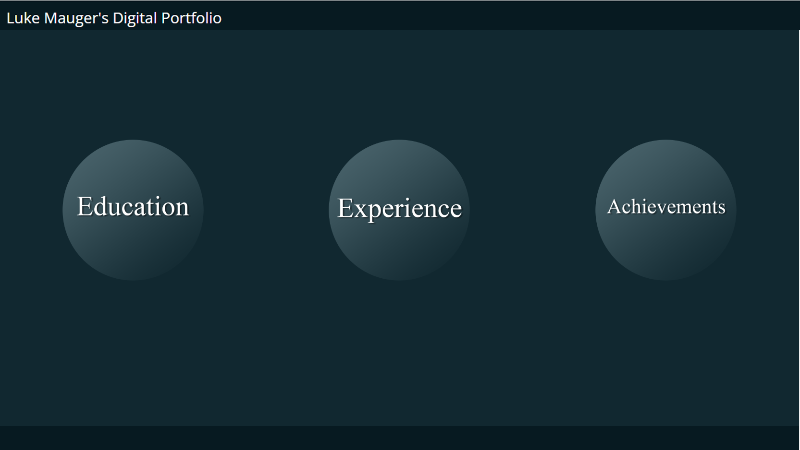

# portfolio
I am creating this portfolio for an IT job with a potential employer I will use it to show them the range of my skill and how much experience I have.
I will do that by showing my work from previous assignments using video's text and images.

## planning 
firstly I will need to choose a colour scheme and font for my portfolio then I will need to make a storyboard and plan the layout of my portfolio.
I will create my portfolio with HTML and CSS.

now that I have created my storyboard I will create my main paige. Once my main paige is done i will create 
## colour scheme
contrast checker https://coolors.co/contrast-checker/071a21-ffffff

https://paletton.com/#uid=13p0u0kgCbEavlyc8fNlo9Bqz6C

I have chosen this colour scheme because it's contrast with my chosen text makes it easier to see for people with poor eyesight.

this is the alternative colour scheme I haver chosen.

I have chosen this because it's contrast with my chosen alternative text makes it easier to see for people who are visually impaired.

https://paletton.com/#uid=1000u0kw0brlIlJr3gpHQ70Sq3g

## text
the colour of my text will be white because it has good contrast with the colour scheme I have chosen this is good because it is easier for people with bad eyesight. 

I have chosen open as my font because  It’s incredibly readable in small sizes and also works great when printed in huge letters.

An alternative font i could have used is Roboto slab because It’s geometric form and friendly curves make it works really well for both headers and body texts. 

colour scheme - https://paletton.com/

## storyboards
This is the story board for my Home page.

This is the storyboard for the education page.

# navigation
This navigation table will tell you which pages link to which the &check; means they will the X means they wont.

|   |Home|Education|Achievements|Experience|Unit 112|Unit 121|Unit 124|Unit 125|Unit 3|MOS|
|---|---|---|---|---|---|---|---|---|---|---|
|Home|&check;|&check;|&check;| &check;  | X  | X  | X  | X  |  X |X|
|Education| &check;  | &check;  | X  |  X |  &check; |  &check; |  &check; |  &check; |  &check; |&check;|
|Achievements| &check;  |  X |  &check; | X  | X  |  X |  X |  X |  X |X|
|Experience| &check;  |  X | X  |  &check; |  X | X | X  |  X |  X |X|
|Unit 112|  X | &check;  | X  |  X | &check; | X  |  X | X  | X  |X|
|Unit 112|  X | &check;   |  X |  X | X  |   X|  X |  X | X  |X|
|Unit 121|  X |&check;    | X  |  X | X  |  &check; |  X |  X |  X |X|
|Unit 124|  X | &check;   |  X |  X |  X |  X |  &check; |  X |  X |X|
|Unit 125|  X | &check;   |  X |  X | X  |  X | X  |  &check; |  X |X|
|Unit 3| X  | &check;   | X  |  X | X  | X  | X  | X  | &check;  |X|
|MOS| X  |  &check;  | X  |  X | X  | X  | X  | X  | X |&check; |
# Asset list

# feedback
## tutor feedback
### Lisa

# student feedback
### Mitchell

Firstly, I approve of the chosen colour scheme, very simple and professional, the layout and the navigation is not complex and easy to navigate through, the animation for the intractable features is a good way of showcasing your coding skills. To improve this, I would add some explanation some more information for what the images are, pretty much add more context so that employers fully understand what they are looking at. Also, I would the add some explanation for what the images of your projects prove so that employers are aware of what skills these are displaying.
### My response to Mitchell's review

### Daine-
 website portfolio looks great nice colour scheme, very eay to navigate and find what you want to know, good design however on unit 125 with powerpoint things there is just to much information and a lot to read.

### 
# Design justification
